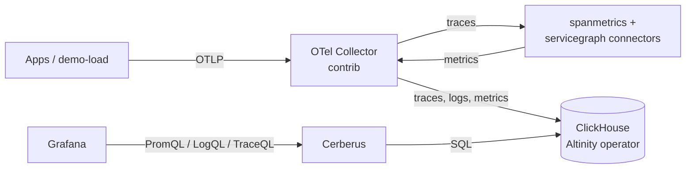

# ClickHouse observability stack (Argo CD app-of-apps)

A GitOps deployment of an OpenTelemetry pipeline that stores **traces, logs and metrics in ClickHouse** and lets **Grafana query them with PromQL, LogQL and TraceQL**. Grafana doesn't talk to ClickHouse directly: Cerberus sits in between and speaks the Prometheus, Loki and Tempo APIs on ClickHouse's behalf.

One Argo CD app-of-apps chart deploys everything else, per environment. Every workload is its own small chart under `cluster-nodes/`, and all of them render their Kubernetes objects through one shared library chart, `helm-templates/common`. It's sized for a laptop and verified end to end on a local kind cluster.



## Components

| App | Image | What it does |
|---|---|---|
| `clickhouse-operator` | `altinity/clickhouse-operator:0.27.4` | Runs ClickHouse from a `ClickHouseInstallation` resource. CRDs and config vendored from [the operator's chart](https://github.com/Altinity/clickhouse-operator) 0.27.4. |
| `clickhouse` | `clickhouse/clickhouse-server:26.9.5.2` | Single-node ClickHouse, tuned for low memory. |
| `cerberus` | `ghcr.io/tsouza/cerberus:1.22.0` | [Cerberus](https://github.com/tsouza/cerberus): Prometheus, Loki and Tempo HTTP APIs over ClickHouse. Also creates the OTel tables. |
| `otel-collector` | `otel/opentelemetry-collector-contrib:0.161.0` | Receives OTLP, derives span metrics and service-graph metrics, scrapes node, pod and container CPU, memory, filesystem and network from the kubelet, and writes to ClickHouse. |
| `grafana` | `grafana/grafana:13.2.2-distroless` | Three datasources that all point at Cerberus, plus a span-metrics dashboard. |
| `demo-load` | `ghcr.io/brandonapol/correlated-telemetrygen:v0.1.0` | Optional synthetic load from [correlated-telemetrygen](https://github.com/brandonapol/correlated-telemetrygen): a `checkout` service calling `payments`, with traces and logs that carry each other's trace and span IDs and the wide-event attributes. |

Each app is a chart in `cluster-nodes/<app>/`. No third-party Helm chart is pulled at deploy time.

Argo CD itself is installed by `scripts/kind-up.sh` (chart `argo/argo-cd` 10.9.2, Argo CD v3.5.3).

## Quick start (local kind cluster)

**Requirements:**
- Docker, with your user able to use it
- `kind`, `kubectl` and `helm`, for example `mise use -g kind kubectl helm`
- About 3 GB of free RAM. The whole cluster used about 2.4 GB in testing.

```bash
scripts/kind-up.sh                         # cluster + Argo CD + the local app-of-apps (~10 min on first run)
kubectl -n argocd get applications -w      # wait for all 7 apps: Synced / Healthy
scripts/port-forward.sh                    # prints URLs and logins
```

| URL | What |
|---|---|
| http://localhost:3000 | Grafana (`admin` / `admin`). Open **Dashboards → Cerberus → Span metrics (RED)**. |
| http://localhost:8080 | Argo CD (`admin` / the password printed by the script) |
| http://localhost:8081 | Cerberus APIs, for curl |
| `localhost:4317` / `http://localhost:4318` | OTLP gRPC / HTTP into the collector |

Tear down with `scripts/kind-down.sh`.

### What you should see

With the default demo load:

| service | requests/s | error rate | p95 latency |
|---|---|---|---|
| `checkout` | 2 | 0% | ~950 ms (it waits on payments) |
| `payments` | 2 | ~25% | ~900 ms |

A quarter of charges time out at the payment gateway. Payments fails those requests, and checkout accepts the order with payment pending, so only payments shows errors. The dashboard's request, error and latency panels count server spans only. The operations table also lists the cache, database and outbound-call client spans.

- **Explore → Tempo (Cerberus):** TraceQL such as `{resource.service.name="payments" && status=error}` finds the failing traces. The Service Graph tab uses the servicegraph metrics. In a trace, **Logs for this span** opens the logs written in that trace.
- **Explore → Loki (Cerberus):** `{service_name="checkout"}` shows the demo log lines. Expand one and **View trace** opens its trace. `{service_name="checkout"} | main="true"` shows only the wide events, one per request, with `duration_ms`, `user.id`, `user.team.id`, `db.query_count`, `cache.hit`, `outcome` and more.
- **Explore → Prometheus (Cerberus):** system metrics from the collector's `kubeletstats` receiver, every 30 s: `k8s_node_cpu_usage` and `k8s_node_memory_working_set` for the node, and the same names under `k8s_pod_` and `container_` per pod and container, plus `*_filesystem_usage` and `*_network_io`.

### Sending your own telemetry

With `scripts/port-forward.sh` running, point any OTLP exporter at `localhost:4317` (gRPC) or `http://localhost:4318` (HTTP). For example:

```bash
OTEL_EXPORTER_OTLP_ENDPOINT=http://localhost:4318 OTEL_SERVICE_NAME=my-app ./my-app
```

Inside the cluster, use `otel-collector.observability:4317`.

To stop the demo load, set `applications.demo-load.enabled: false` in `cluster-configs/overrides/values-local.yaml` and push. The app-of-apps prunes it. In a `make dev/up` cluster, run `make dev/load/stop` instead.

## Local development (no Argo CD)

The quick start above deploys the way a real cluster does: Argo CD pulls a pushed revision from GitHub. To
iterate on dashboards, collector config or any other value, `make dev/up` skips Argo CD and installs each
chart with `helm`, straight from your working tree. It uses the same releases, namespaces and values as the
`local` environment, in sync-wave order, and it leaves out the demo load so you choose what data arrives.

Needs `kind`, `kubectl`, `helm` and `yq` (for example `mise use -g kind kubectl helm yq`).

```bash
make dev/up                      # kind + every app except demo-load
make dev/port-forward            # Grafana :3000, Cerberus :8081, OTLP :4317 / :4318 (leave running)
make dev/load                    # start the demo load; make dev/load/stop stops it
make dev/apply APP=grafana       # redeploy one app after editing cluster-nodes/<app> or values-local.yaml
make dev/down                    # delete the cluster
```

`make dev/up` refuses a cluster that already runs Argo CD, because Argo CD would revert whatever helm
installs. Run `make cluster/down` first.

**Editing dashboards:** in `local`, Grafana lets you save provisioned dashboards from the UI. Saved changes
last only until the Grafana pod restarts, and `make dev/apply APP=grafana` restarts it. To keep a change,
export the dashboard as JSON (**Export → Export as JSON**) into `cluster-nodes/grafana/dashboards/`, then run
`make dev/apply APP=grafana` and `make generate`.

## Design decisions

### Span metrics: the collector's `spanmetrics` connector, not a ClickHouse materialized view

Both were considered. The connector was chosen because:

- **It counts before sampling.** The connector sees every span as it passes through the collector. A materialized view only sees spans that were actually stored, so any trace sampling would make request and error counts wrong.
- **Its output works in Grafana as-is.** It produces standard counter and histogram series, with trace-ID exemplars. Those are exactly what PromQL `rate()` and `histogram_quantile()`, and therefore Grafana's RED dashboards, expect through Cerberus.
- **A view is a poor fit here.** A ClickHouse view fires once per insert batch, so it would produce fragmented delta rows rather than proper time series. It would also have to reproduce the exporter's histogram layout exactly, and that layout has changed between exporter versions.

**The trade-off:** the connector keeps counters in memory. With more than one collector replica, each replica produces its own series (distinguished by a `collector_instance_id` label), and a restart starts the counters over. PromQL `rate()` handles both. If you scale out, route spans to collectors by trace ID with the `loadbalancing` exporter.

The `servicegraph` connector was also added, because Grafana's Tempo "Service Graph" view expects its metrics.

Resulting metric names, as queried through Cerberus:

- `traces_span_metrics_calls` — counter, labelled `service_name`, `span_name`, `span_kind`, `status_code`, plus `http_*` dimensions
- `traces_span_metrics_duration_bucket` / `_sum` / `_count` — histogram in milliseconds
- `traces_service_graph_request_total`, `traces_service_graph_request_failed_total`, and related metrics

### Cerberus creates the tables, not the collector

Cerberus is validated against the ClickHouse exporter's **v0.152** table layout. The latest exporter (v0.161) changed some column types; for example, metrics `TimeUnix` went from `DateTime64(9)` to `DateTime`. So:

- Cerberus runs with `CERBERUS_AUTO_CREATE_SCHEMA=true` and creates the database and tables in the layout it expects.
- The collector's exporter runs with `create_schema: false` and inserts into those tables.

This combination was tested: exporter v0.161 inserts into the v0.152 layout without errors, and Cerberus answers PromQL, LogQL and TraceQL correctly over the result.

### Sync order

Child apps carry sync waves:

| wave | app |
|---|---|
| 0 | operator |
| 1 | ClickHouse |
| 2 | Cerberus |
| 3 | collector, Grafana |
| 4 | demo-load |

The waves are set in `cluster-configs/app-of-apps/values.yaml`. Argo CD doesn't track child-app health by default, so `cluster-configs/argocd/values.yaml` adds two health checks:
- one that treats a child Application as healthy only when it's synced *and* healthy
- one that treats the ClickHouse installation as healthy only once the operator reports it `Completed`

On the very first install, expect a few minutes of retry noise. The collector logs DNS and "database does not exist" errors, and Cerberus reports not-ready, until ClickHouse is up and Cerberus has created the tables. Both recover on their own.

### Low-memory sizing

Everything is sized for light local testing:

| component | memory request | memory cap |
|---|---|---|
| ClickHouse | 256 Mi | 1 Gi |
| Grafana | 96 Mi | 384 Mi |
| Cerberus | 64 Mi | 384 Mi |
| Collector | 64 Mi | 256 Mi |
| Operator | 48 Mi | 192 Mi |

ClickHouse also gets a `config.d/low_memory.xml` (in `cluster-nodes/clickhouse/values.yaml`; the `prod` environment removes it) with:
- small caches
- fewer background threads
- its internal system log tables (query log, metric log, trace log and so on) turned off

`background_pool_size` is left at its default on purpose: ClickHouse refuses to create tables if it's lower than its merge and mutation thresholds.

## Repository layout

```
cluster-configs/
  app-of-apps/
    Chart.yaml, values.yaml    Chart that renders one Argo CD Application per app, with sync waves
    templates/application.yaml
    app-of-apps-local.yaml     The one Application you apply per environment
    app-of-apps-prod.yaml
  overrides/
    values-local.yaml          Per-environment values the app-of-apps chart ingests
    values-prod.yaml
  argocd/values.yaml           Argo CD's own Helm values: small footprint, health checks for waves
cluster-nodes/<app>/
  Chart.yaml                   Depends on helm-templates/common
  values.yaml                  The whole app, environment-neutral
  templates/common.yaml        {{ include "common.all" . }}
  tests/                       helm-unittest suites
helm-templates/common/         Library chart: Deployment, Service, RBAC, ConfigMaps, Secrets, custom resources
tests/
  charts/common-fixture/       Exercises the library in unit tests
  golden/<env>/                Every node rendered as Argo CD deploys it (generated, checked in CI)
scripts/                       kind-up / dev / port-forward / kind-down, render, and the check scripts
git/hooks/                     pre-commit hook that runs `make check/lint`
kind-config.yaml               Local cluster definition
Makefile                       setup, generate, checks, tests and local-cluster targets (`make help`)
AGENTS.md                      conventions for contributors and coding agents
```

### Environments and overrides

A value reaches a pod through four layers, each overriding the one before:

1. `helm-templates/common` defaults
2. `cluster-nodes/<app>/values.yaml`
3. `cluster-configs/app-of-apps/values.yaml` (the application list and sync waves)
4. `cluster-configs/overrides/values-<env>.yaml`, under `applications.<app>.values`

For example, to give Cerberus more memory in prod:

```yaml
applications:
  cerberus:
    values:
      deployment:
        containers:
          cerberus:
            resources:
              limits:
                memory: 2Gi
```

Containers, ports, env vars and volumes are maps keyed by name, so this changes one field and leaves the rest
of the container alone. `helm-templates/common/README.md` documents every key.

`local` is what `scripts/kind-up.sh` deploys. `prod` is a worked example: no demo load, no low-memory tuning,
larger resources, and Secrets you create yourself (`clickhouse-credentials`, `grafana-admin` and
`clickhouse-operator-credentials`). To add an environment, run `make env/new NAME=<env>`. It writes a short, commented
`values-<env>.yaml` and the matching `app-of-apps-<env>.yaml`, and refuses to overwrite either unless you pass
`FORCE=1`. Every application starts from its node defaults; add only what differs.

### Stable names

The apps find each other by hard-coded name, port and Secret, not by discovery. Every object is named after
its Argo CD release, which is the key under `applications:` in `cluster-configs/app-of-apps/values.yaml`
(`nameOverride` in a node's values replaces it as the base name of every object, see
`helm-templates/common/README.md`). Nothing sets `nameOverride` today, so the app name is the Service name.
Namespaces and waves come from the same file: `clickhouse-operator` lives in its own namespace, everything
else in `observability`.

| app | name | namespace | Service ports | Secrets it reads (keys) | wave |
|---|---|---|---|---|---|
| operator | `clickhouse-operator` | `clickhouse-operator` | none; the pod exposes `9999` (metrics) | `clickhouse-operator-credentials` (`username`, `password`) | 0 |
| ClickHouse | installation `otel`; Service `clickhouse` | `observability` | `8123` http, `9000` tcp | `clickhouse-credentials` (`password`; `username` is set to `otel` when the Secret is created) | 1 |
| Cerberus | `cerberus` | `observability` | `8080` http | `clickhouse-credentials` (`password`) | 2 |
| collector | `otel-collector` | `observability` | `4317` OTLP gRPC, `4318` OTLP http | `clickhouse-credentials` (`password`) | 3 |
| Grafana | `grafana` | `observability` | `80` http (pod port `3000`) | `grafana-admin` (`admin-user`, `admin-password`) | 3 |
| demo load | `demo-load` | `observability` | none; it only sends | none | 4 |

The ClickHouse pod is `chi-otel-main-0-0-0`. The operator owns the Service `clickhouse` (from
`generateName`) and the installation `otel`, so `nameOverride` on the `clickhouse` node does not rename
either of them. It does rename the Secret: the installation reads `<name>-credentials`, which is
`clickhouse-credentials` only while the release is called `clickhouse`. Likewise the operator's Secret is
`<name>-credentials` and Grafana's is `<name>-admin`. Cerberus and the collector name
`clickhouse-credentials` literally, so renaming the ClickHouse Secret means changing both.

`nameOverride` (or renaming the app key) changes the Service name and the Secret names built from it. These
have to move together:

- **ClickHouse address**: the collector's exporter endpoint `tcp://clickhouse:9000` and Cerberus's
  `CERBERUS_CH_ADDR: clickhouse:9000`. Both dial the Service the operator generates.
- **Cerberus URL**: the three datasource `url` fields in Grafana's `datasources.yaml`, all
  `http://cerberus:8080`.
- **Collector endpoint**: the demo load's `OTEL_EXPORTER_OTLP_ENDPOINT: http://otel-collector:4317`, and
  anything you send telemetry from.
- **ClickHouse Secret**: the `secretKeyRef` in the installation, Cerberus and the collector, plus the Secret
  every environment pre-creates.
- **Namespace**: the operator's `watch.namespaces.include` must list `observability`, where the installation
  lives, and its ClusterRoleBinding subject must name the operator's own namespace.

The node tests fail when one of these moves:

- `cluster-nodes/clickhouse/tests/clickhouse_test.yaml`: the installation name `otel`, its namespace, the
  `clickhouse` Service template, and the `clickhouse-credentials` Secret and its `password` key.
- `cluster-nodes/cerberus/tests/cerberus_test.yaml`: Service `cerberus` on `8080`, the Secret read, and
  `CERBERUS_CH_ADDR`.
- `cluster-nodes/otel-collector/tests/otel_collector_test.yaml`: Service `otel-collector` on `4317` and
  `4318`, and the exporter's `create_schema: false`.
- `cluster-nodes/grafana/tests/grafana_test.yaml`: every datasource pointing at Cerberus, the `grafana-admin`
  Secret, and the Service on `80`.
- `cluster-nodes/clickhouse-operator/tests/clickhouse_operator_test.yaml`: the watched namespace, the
  `clickhouse-operator-credentials` Secret and the ClusterRoleBinding namespace.
- `cluster-nodes/demo-load/tests/demo_load_test.yaml`: the collector endpoint it sends to.

If you change one on purpose, change its pair in the same commit and update the test that pins it.

## Upgrades

Bump one component per PR unless two must move together. These are the sets that must. Each tag lives in the
node's own `values.yaml` (the nodes are environment-neutral; no `values-<env>.yaml` sets an image tag), and
`appVersion` in the node's `Chart.yaml` moves with it.

| Moves together | Where | Why |
|---|---|---|
| Cerberus and the collector image | `cluster-nodes/cerberus/values.yaml` (`tag`, today `1.22.0`) and `cluster-nodes/otel-collector/values.yaml` (`tag`, today `0.161.0`), plus each `Chart.yaml` `appVersion` | Cerberus creates the tables and the collector inserts into them with `create_schema: false`. A bump to either can break inserts or queries without any manifest changing. |
| The operator image, its CRDs and its config files | `cluster-nodes/clickhouse-operator/values.yaml` (`tag`, today `0.27.4`), `cluster-nodes/clickhouse-operator/crds/` and `cluster-nodes/clickhouse-operator/files/` (`chi-config.d`, `chi-users.d`, `chk-keeper_config.d`) | The CRDs and config files are copied verbatim from one operator release. Replace them from the release you bump to, and read its notes first: the CRD surface changes between minor versions (0.27.4 removed `user/k8s_secret_password`). |
| The demo load image and `appVersion` | `cluster-nodes/demo-load/values.yaml` (`tag`, today `v0.1.0`) and `cluster-nodes/demo-load/Chart.yaml` | The Grafana log and trace links depend on the `trace_id` log attribute the load generator emits. |

For every bump, also update the Components table above, then run `make generate` to re-render `tests/golden`
and commit the result with the change.

### What the checks prove

A golden diff is expected on a bump: it is the exact image and `checksum/config` change that makes pods roll.
It shows what will change in the cluster, not that the pipeline still works.

`make check` proves the manifests are well-formed and the images are pinned. It does **not** prove a Cerberus or
collector bump. Neither a changed table layout nor a column type mismatch shows up in a manifest, so the check
for that pair is a deploy to kind and the queries:

```bash
make test/e2e REVISION=my-branch   # needs Docker, and a pushed branch
```

The e2e run queries span metrics, logs and traces through Cerberus. For anything it does not cover, run
`make cluster/up REVISION=my-branch` and `make cluster/port-forward`, and compare Grafana with
[What you should see](#what-you-should-see).

## Contributing

```bash
make setup      # check tools (needs Go, Python 3 and Node) and the pre-commit hook
make test       # helm-unittest suites for the library, every node and the app-of-apps chart
make generate   # re-render tests/golden after changing any chart or values
make check      # what CI runs: yamllint, shellcheck, layout rules, actionlint, cspell,
                # tests/golden up to date, and kubeconform plus container policy over it
make test/e2e REVISION=my-branch   # needs Docker: deploy a pushed branch to kind and query it
```

### How the tests stay predictable

| Layer | What it catches | Where it runs |
|---|---|---|
| helm-unittest | a template or value that renders the wrong object; the contracts between apps (Secret names, Service ports, schema ownership) | `make test`, offline |
| Golden renders | any change to what lands in a cluster, per environment, shown as a diff in the PR | `make check`, offline |
| kubeconform + policy | invalid objects, missing memory limits, unpinned images | `make check`, pinned schemas |
| kind e2e | ordering, health, and whether data actually flows from OTLP to Grafana | CI on every PR, or locally with Docker |

Everything that could drift is pinned: tool versions in the `Makefile`, Kubernetes `1.37.0` for rendering,
schemas and the kind node image (by digest), and the schema sources by commit. No chart is fetched from a
registry. So the first three layers give the same answer on any machine, and the e2e job only differs where
the network does: image pulls and the Argo CD chart.

[`AGENTS.md`](AGENTS.md) has the conventions and what to update when adding or bumping a component.

## Troubleshooting

These problems all came up while building this, and the fixes are already in the repo.

Before the first sync of a new cluster, `make cluster/preflight ENV=<env>` checks that the Secrets the environment expects and a StorageClass for the ClickHouse volume exist, and prints what is missing; it installs nothing.

- **`kind create cluster` fails at "Starting control-plane" (API server connection refused):**
  - Hosts with a **btrfs root on an encrypted (`/dev/mapper`) volume** need `/dev/mapper` mounted into the kind node, or the kubelet never starts the control plane.
  - Slow container creation on such hosts also needs longer kubeadm timeouts.
  - `kind-config.yaml` handles both.
- **ClickHouse pod never appears:**
  - The Altinity operator only watches its own namespace by default. `cluster-nodes/clickhouse-operator/values.yaml` sets `watch.namespaces.include: [observability]` in its `config.yaml`.
  - Check `kubectl -n observability get chi otel -o jsonpath='{.status.status} {.status.errors}'`.
- **Installation `Aborted` with `RemovedSecretRefSyntax`:** operator 0.27.4 removed `user/k8s_secret_password`. Use `user/password: {valueFrom: {secretKeyRef: ...}}` instead, as this repo does.
- **Grafana restarts and never becomes Ready:** Grafana 13 downloads its bundled app plugins from grafana.com on every start (its storage is an emptyDir), and on a slow machine or network that outlasts the liveness probe. `cluster-nodes/grafana/values.yaml` sets `preinstall_disabled = true`; the stack only uses the three Cerberus datasources.
- **Cerberus stays `0/1 Ready`:** it reports not-ready until it has created the schema. Check `kubectl -n observability logs deploy/cerberus`.
- **A Loki API call returns `missing or invalid 'end' parameter`:** Cerberus requires both `start` and `end` on `query_range`. Grafana always sends both; this only affects hand-written curl calls.
- **Querying ClickHouse directly:**
  ```bash
  kubectl -n observability exec -it chi-otel-main-0-0-0 -c clickhouse -- \
    clickhouse-client --user otel --password otel-local-dev
  ```

## Before using this beyond a laptop

- **Credentials:** the ClickHouse password and the Grafana `admin`/`admin` login in `cluster-configs/overrides/values-local.yaml` are **public, local-only credentials**. The `prod` environment creates no Secrets; supply them from a secret manager (for example External Secrets or Sealed Secrets).
- **ClickHouse sizing:** raise the memory settings, and remove or relax the low-memory config.
- **Collector scaling:** use trace-ID-aware load balancing so span metrics stay consistent across replicas.
- **System metrics on more than one node:** the collector is a single Deployment, so `kubeletstats` only reads the kubelet on the node it runs on. Run a DaemonSet of collectors for it, and verify the kubelet's serving certificate instead of `insecure_skip_verify`.
- **Retention:** set it with `CERBERUS_SCHEMA_TTL` in `cluster-nodes/cerberus/values.yaml` (currently `7d`). Also set `CERBERUS_PROM_METADATA_LOOKBACK` if retention exceeds 14 days.
- **Cerberus maturity:** it's a young project (1.x, moving fast). Pin versions and test upgrades.
